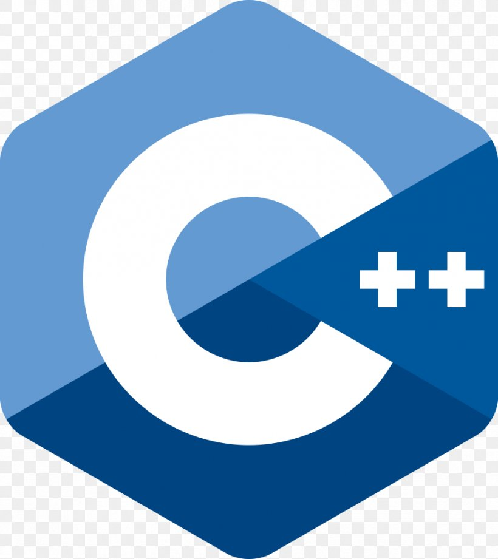

### Hi there 👋 I'm Prasad -[Prasad Ramesh Shirude]

I'm Developer, Self-leaner, Student

- 🔭 I’m currently pursuing MSc. Computer Science
- 🌱 I’m currently learning JavaScript/Angular
- 💬 Ask me about programming

### Connect with me:

  [][linkedin]
  [][instagram]
  [][twitter]
   
  
  [linkedin]: https://www.linkedin.com/in/prasad-shirude-90a9b71ba/
  [instagram]: https://www.instagram.com/prasad_9689/
  [twitter]: https://twitter.com/PrasadShirude1
  
   
  
  ###  Languages & Tools:
  
   
   
  
  
  

 

